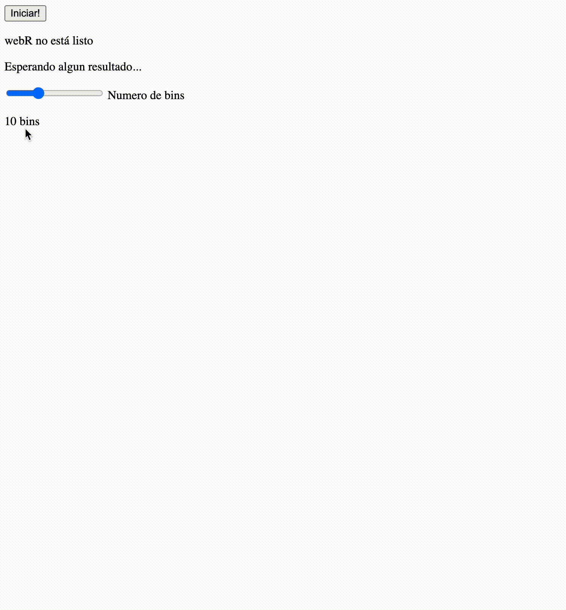

# Intro a webR (con Svelte)



Código final del tutorial presente en LINK A BLOG POST.

Para correrlo usa 
```
npm install
npm run dev
```
en tu terminal.

Alternativamente, intenta este LINK A LA APP EN NETLIFY

Mas allá, puedes editarla directamente en STACKBLITZ CODEFLOW LINK